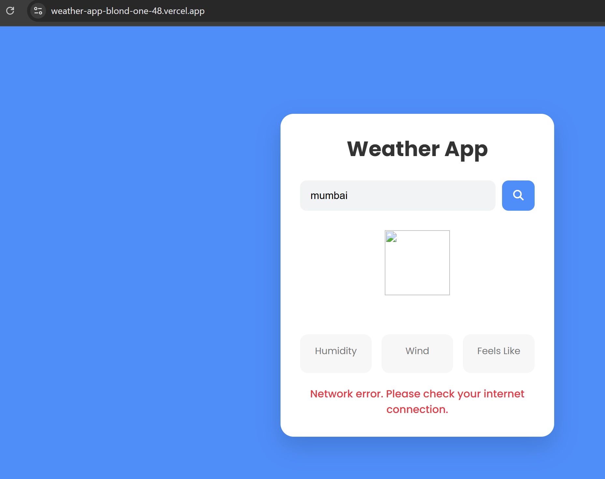
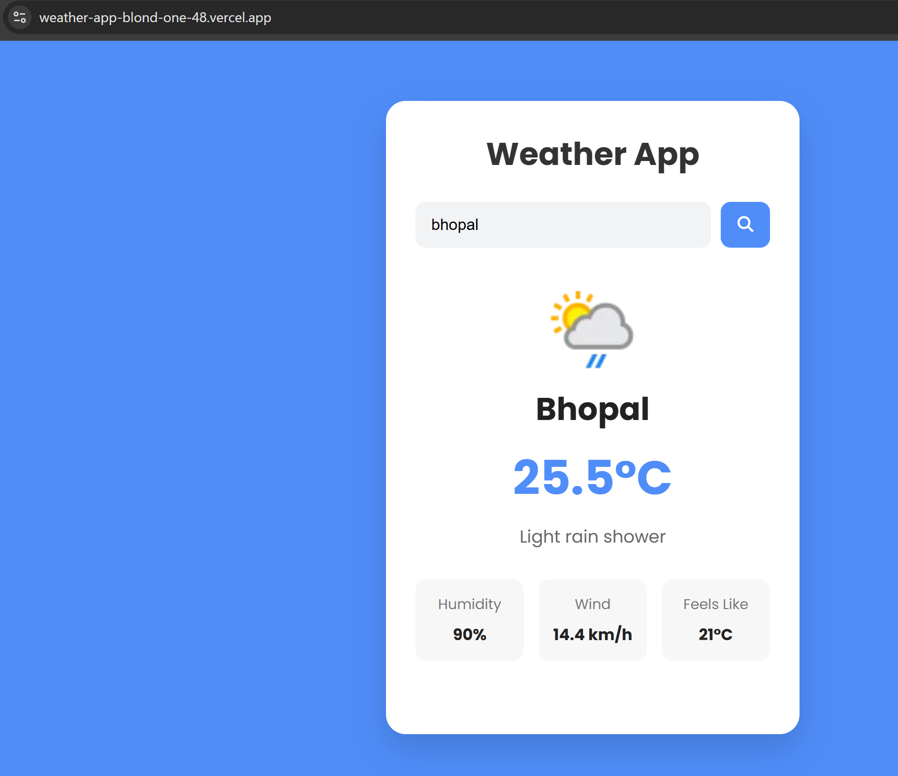
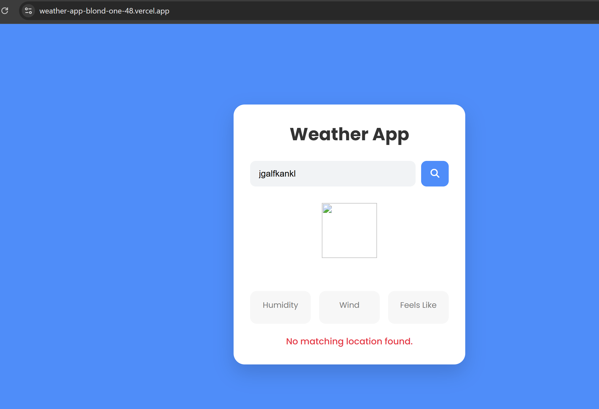

# Javascript Weather App

This is a simple weather application built using HTML, CSS, and JavaScript. Users can search for the current weather of any city. 

## Features

- Search weather by city name
- Current temperature
- Weather condition
- Humidity
- Wind speed
- Feels like temperature
- Dynamic weather icon
- Loading state
- Error handling

## Technology Used

- HTML5
- CSS3
- JavaScript (ES6+)
- WeatherAPI

## What I Learned

- Working with REST APIs
- Using fetch() with async/await
- Handling API and network errors
- Updating the DOM dynamically
- Managing loading states
- Organizing code into reusable functions

## Live Demo

https://your-vercel-url.vercel.app

## Screenshot

### Nointernet Result

### Weather Result

### Invalid City

## Live Demo

[Live Demo](https://weather-4k5y0aaj4-ayushgupta0508s-projects.vercel.app)

## Author

**Ayush Kumar**